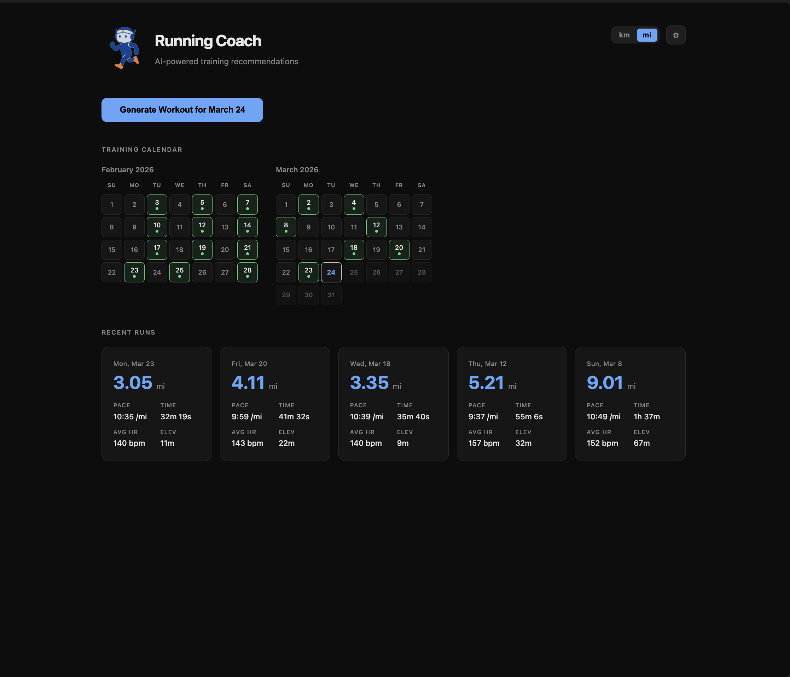
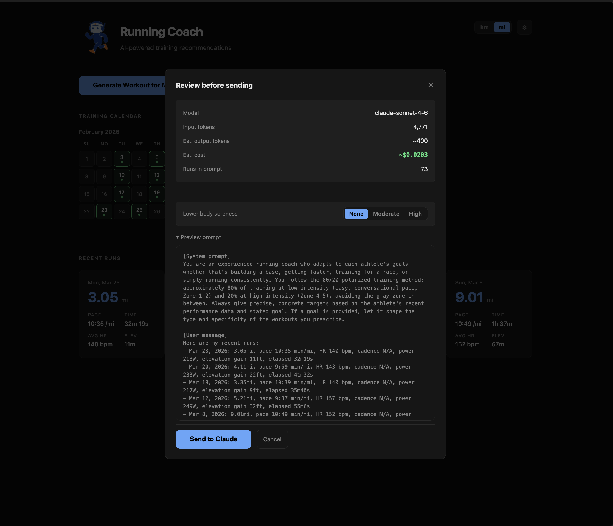
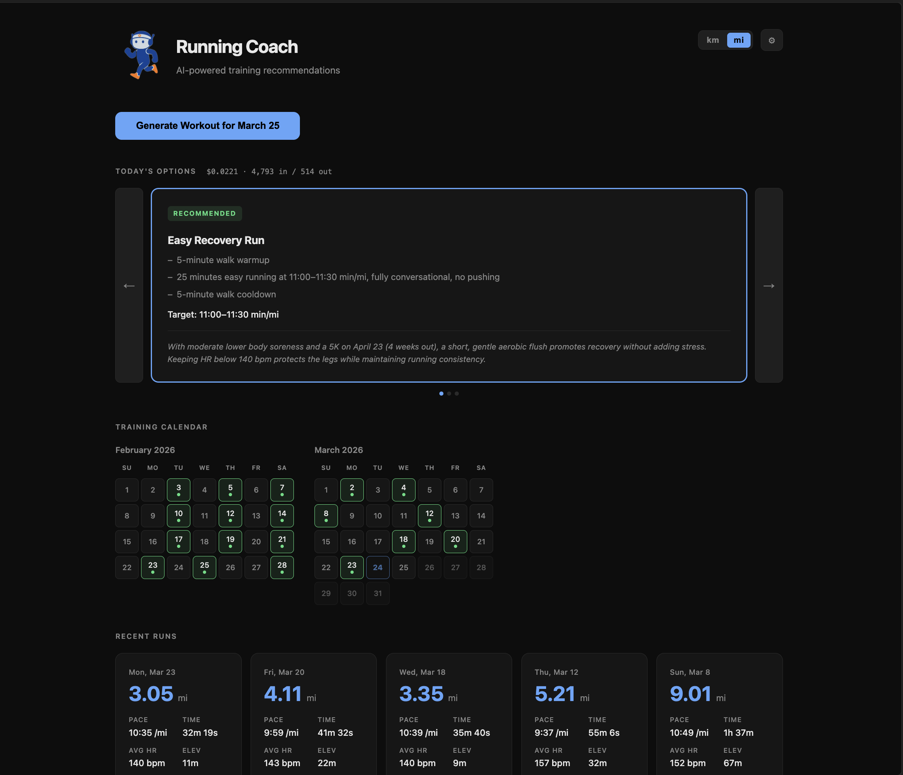
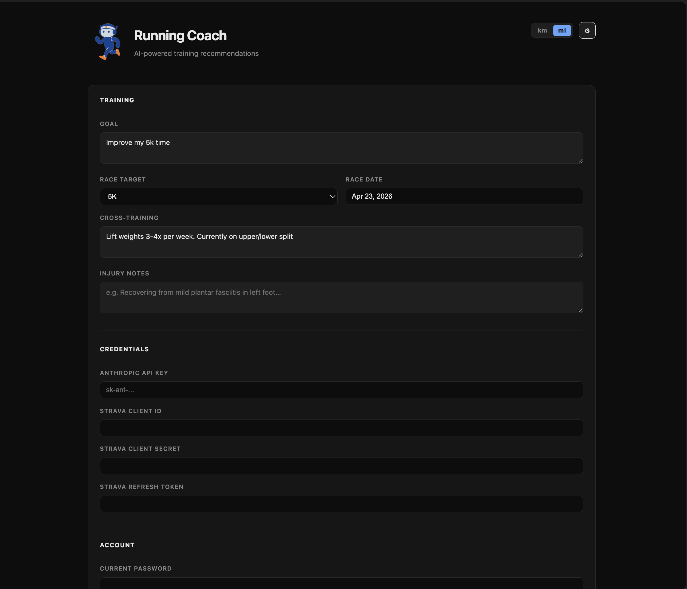

# Running Coach

An AI-powered running coach that uses Claude to generate personalized workout recommendations based on your training history — logged manually, run by run.



## Features

- Log your runs by hand (distance, time, heart rate, cadence, power, elevation)
- Generates a recommended workout + alternatives using Claude (claude-sonnet-4-6)
- Follows the 80/20 polarized training method by default
- Tracks which workout you selected each day
- Plan workouts for future dates on the calendar
- Persists your goal, race target, cross-training notes, and injury context
- Displays personal records (1 mile, 5K, 10K, half, marathon) and includes them in the coaching prompt
- Cost estimate before every generation (~$0.02 per request)
- Self-hostable with Docker, protected by a password

---

## Screenshots







---

## Self-hosting with Docker

```bash
docker run -d \
  --name claude-coach \
  --restart unless-stopped \
  -p 4218:4218 \
  -v ./data:/app/data \
  ghcr.io/rileygriffith/claude-coach:latest
```

Or with Docker Compose:

```yaml
services:
  claude-coach:
    image: ghcr.io/rileygriffith/claude-coach:latest
    ports:
      - 4218:4218
    volumes:
      - ./data:/app/data
    restart: unless-stopped
```

Open `http://your-server:4218` and follow the setup wizard — no environment variables needed.

### First-run setup

1. **Create your account** — choose a username and password
2. **Add your Anthropic API key** — get one from [console.anthropic.com](https://console.anthropic.com)
3. **Log your first run** — click **+ Log a run** on the dashboard and enter your distance, time, and any other stats you tracked

### Data persistence

All data lives in a single SQLite database inside the container at `/app/data`. The volume mount keeps it on your host so it survives container updates and restarts.

### Personal records

Personal records are shown on the dashboard and included in the coaching prompt so Claude can set accurate target paces. They're calculated from your logged run history (fastest run of approximately each standard distance).

### Running behind a reverse proxy

The app is designed to sit behind a reverse proxy (nginx, Caddy, etc.) that handles SSL. HTTPS is strongly recommended when exposing to the internet — secure cookies are enabled automatically outside of development mode.

---

## Running locally

```bash
git clone https://github.com/rileygriffith/claude-coach
cd claude-coach
npm install
echo "NODE_ENV=development" > .env
npm start
# → http://localhost:4218
```

---

## How it works

1. Log your runs as you complete them — distance, time, heart rate, cadence, power, elevation
2. Click **Generate Workout** for today or select a future date on the calendar
3. Review the prompt, add any notes (soreness, etc.), and send to Claude
4. A recommended workout is shown — swipe through alternatives if you want something different
5. Select the workout you plan to do, then log the run and how it went afterward
6. Your run history and results are stored and included in future prompts so the coach builds on your history
